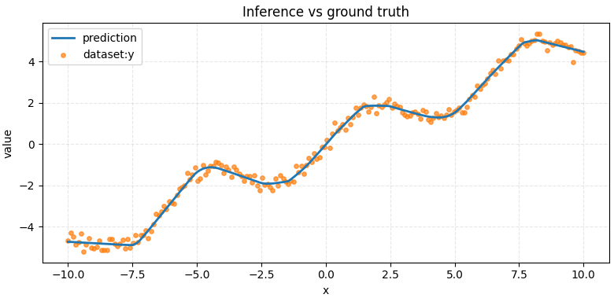

# nn-func-predict

Проект для обучения многослойного перцептрона, аппроксимирующего одномерную функцию по точкам из CSV. Скрипты покрывают полный цикл: генерация синтетических данных, обучение, оценка и инференс модели.



## Структура проекта

```
.
├─ data/
│  ├─ generate.py        # генерация синтетического набора точек
│  ├─ view.py            # визуализация и сводные статистики датасета
│  └─ processed/
│     └─ dataset.csv     # пример готового датасета
├─ src/
│  ├─ dataset.py         # Dataset и конфиг, нормализация и Fourier-признаки
│  ├─ eval.py            # оценка MSE на полном CSV
│  ├─ inference.py       # сохранение прогнозов модели в CSV
│  ├─ model.py           # архитектура MLPRegressor
│  ├─ train.py           # цикл обучения и ранняя остановка
│  └─ utils.py           # сид, JSON-утилиты, подсчёт параметров
├─ runs/                 # по умолчанию сюда логируются чекпойнты и метаданные
├─ out/                  # предсказания инференса
└─ .env                  # переменные окружения для генерации данных
```

## Требования и запуск

1. Python 3.9.
2. Установите зависимости:
   ```bash
   pip install torch pandas numpy matplotlib python-dotenv
   ```
3. (Опционально) создайте виртуальное окружение и активируйте его.

## Переменные окружения

Файл `.env` в корне (используется `data/generate.py`):

```
DATA_NAME='dataset.csv'
DATA_DIR='data/processed'
```

`data/view.py` дополнительно ищет `data/.env`. Если вы хотите хранить альтернативные пути только для визуализации, создайте там файл с такими же ключами.

## Генерация и анализ данных

```bash
python data/generate.py
```

- использует функцию `func(x)` (по умолчанию `sin(x) + 0.5x`);
- добавляет гауссов шум `noise_std`;
- сохраняет CSV в `DATA_DIR/DATA_NAME`.

Для визуальной проверки:

```bash
python data/view.py
```

Скрипт загрузит набор точек, выведет head/describe и построит scatter/line график.

## Архитектура модели

`src/model.py:MLPRegressor` — последовательность `Linear → ReLU → Dropout` повторённая `depth` раз, финальный слой выводит одно значение. На вход подаётся нормализованный `x` и, при необходимости, синусоидальные Fourier-признаки.

Ключевые гиперпараметры (управляются флагами `train.py`):

| Параметр | Значение по умолчанию | Назначение |
|----------|-----------------------|------------|
| `hidden` | 256                   | ширина скрытых слоёв |
| `depth`  | 3                     | число блоков `Linear+ReLU(+Dropout)` |
| `dropout`| 0.0                   | вероятность дропа нейронов |
| `fourier-dim` | 0               | количество син/кос пар для Fourier-features |
| `fourier-scale` | 1.0           | множитель частоты для Fourier-признаков |

## Обучение модели

Базовый запуск:

```bash
python -m src.train --csv data/processed/dataset.csv --out-dir runs/exp1
```

Артефакты:

- `model.pt` — состояние модели, конфиг датасета, статистики, сид;
- `meta.json` — лучшая вал. ошибка и статистики признаков.

### Группы флагов `src/train.py`

- **Данные:** `--csv`, `--x-col`, `--y-col`, `--use-y-true`, `--val-fraction`, `--fourier-dim`, `--fourier-scale`, `--aug-x`, `--aug-y`, `--no-normalize`.
- **Оптимизация:** `--batch-size`, `--epochs`, `--lr`, `--wd`, `--early-stop`.
- **Архитектура:** `--hidden`, `--depth`, `--dropout`.
- **Сервис:** `--out-dir`, `--seed`, `--cpu`.

Сид передаётся в `set_seed`, поэтому обучение воспроизводимо при фиксированных данных и настройках.

## Оценка качества

```bash
python -m src.eval --checkpoint runs/exp1/model.pt
```

- загружает обученную модель;
- пересобирает `GraphDataset` в режиме `all`;
- печатает среднеквадратичную ошибку (MSE) по всему CSV.

Дополнительные флаги: `--seed`, `--cpu`.

## Инференс и экспорт предсказаний

```bash
python -m src.inference --checkpoint runs/exp1/model.pt --out-csv out/predictions.csv
```

- без `--x-csv` генерирует линейное пространство `x` от `--x-min` до `--x-max` (`--n-points` точек);
- при передаче `--x-csv` ожидает колонку `x` и прогнозирует значения в тех же координатах;
- сохраняет CSV c колонками `x` и `y_pred`.
